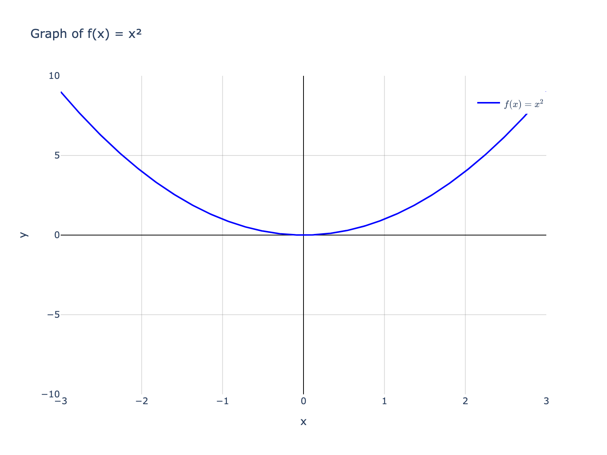
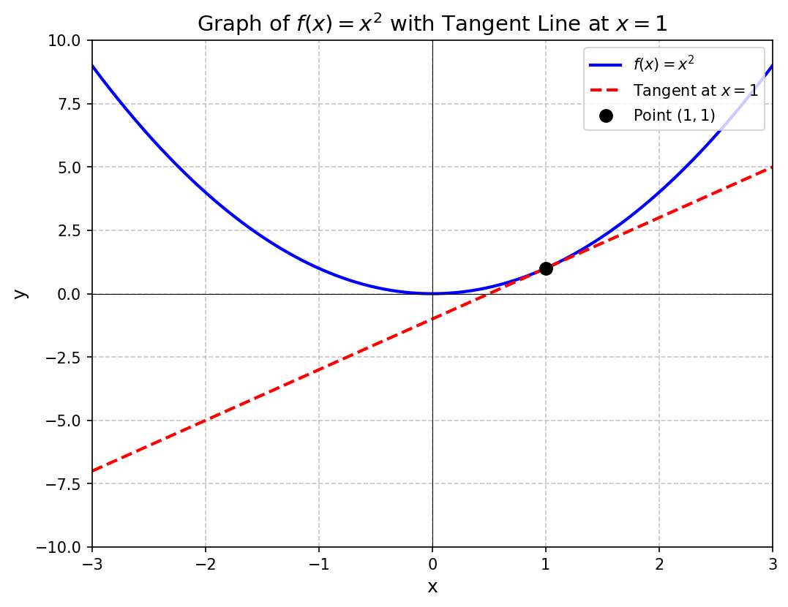
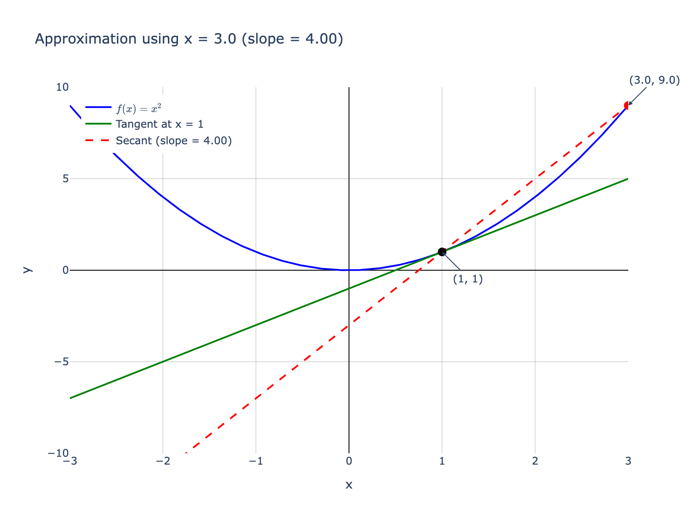
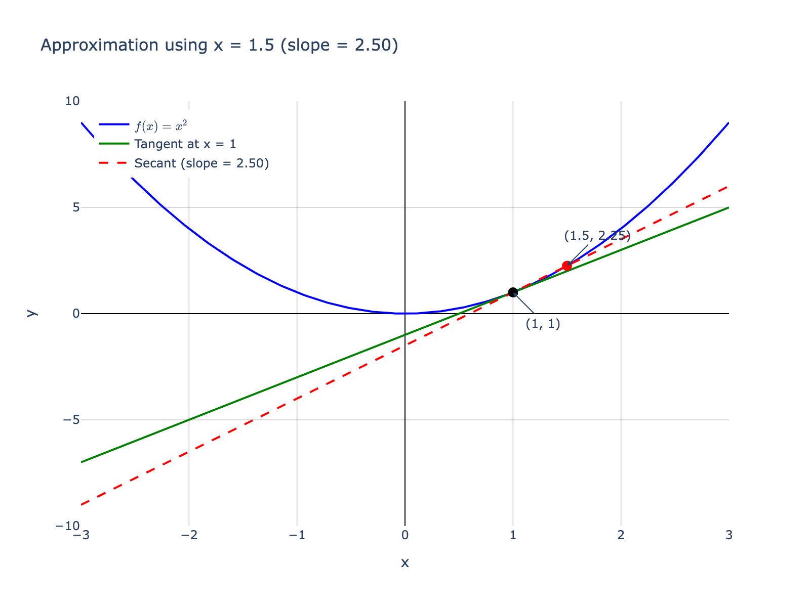
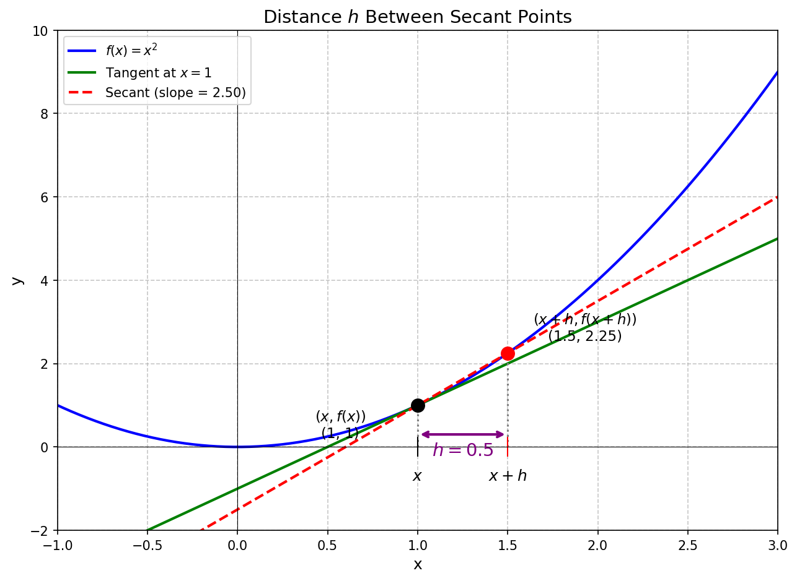
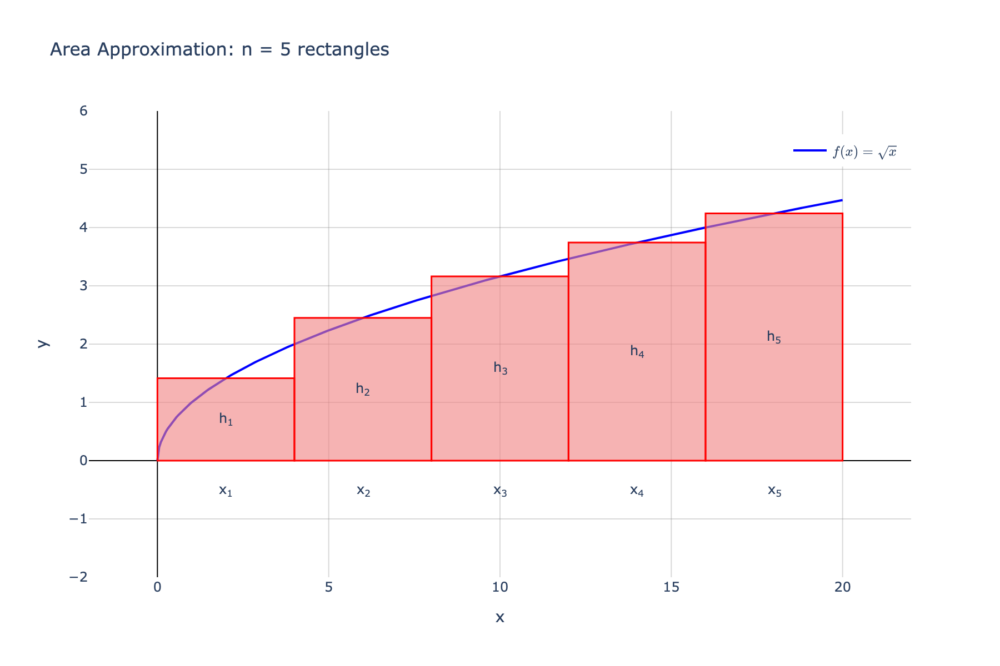
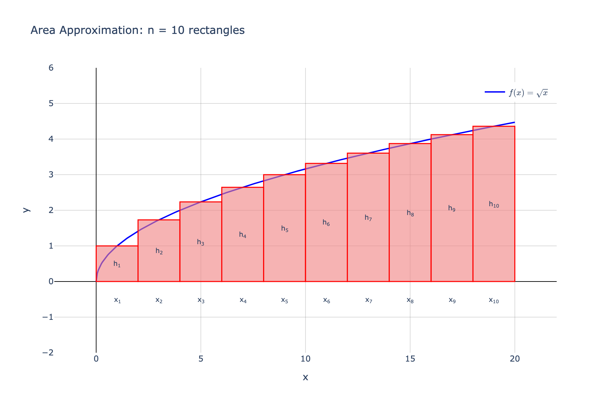
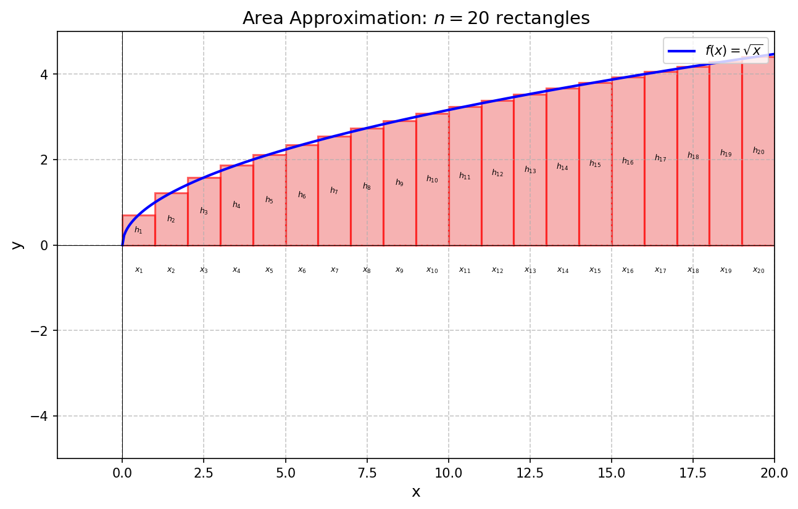
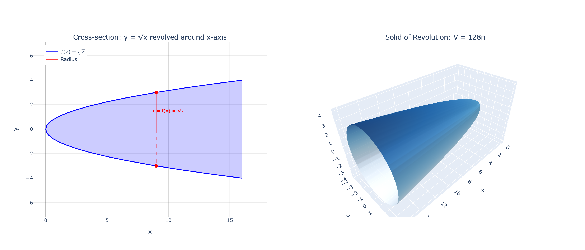

# My High School Calculus Final

## Overview

This is a close recration of my calculus final.  I am not changing the wording too much, but if I find a missing comma or a math mistake here or there I will correct that.  Some of the wording is inpercice, and some steps were skipped, but I am trying to keep it as verbatim as possible.

### Note for my classmates & teacher

5 other people may have the original document and may note some key differences.  I am keeping this as true to the original work as possible while using better graphing technology via python.  There are probably better graphing solutions out there, but I am using what I am currently most familiar with that's easy to check into software version control.

## Final Content

**Robert Jackson**

**Calculus**

**Calculus Final**

**19 May 2009**

---

### The Derivative

The derivative is just a way to find the slope of a function at any given point. This is called the **instantaneous rate of change**. The way that the derivative was first derived was from the slope formula:

$$
\frac{\text{rise}}{\text{run}}
$$

This is more commonly known as:

$$
\frac{\Delta y}{\Delta x}
$$

or as:

$$
\frac{y_1 - y_2}{x_1 - x_2}
$$

> **Note from the future:** I like final minus initial more here as that makes more sense that the notation that I have here.
> $$
> \frac{y_f - y_i}{x_f - x_i}
> $$

Now if:

$$
y = f(x)
$$

then we can rewrite the previous equation as:

$$
\frac{f(x_1) - f(x_2)}{x_1 - x_2}
$$

This equation works great for finding the slope of a line in between two points. However, if we want to find the slope of a line that is **tangent**, meaning that it touches a curve at only one point, we have to think outside of the box.

Suppose that we have a graph with a curve like the one shown in the graph:

$$
f(x) = x^2
$$

If we wanted to find the slope of the function between two points it would be easy using:

$$
\frac{f(x_1) - f(x_2)}{x_1 - x_2}
$$

But suppose that we wanted the slope at a single point:

$$
x = 1
$$

We would have:

$$
f(x) = x^2
$$

$$
\frac{f(1) - f(1)}{1 - 1}
$$

$$
f(1) = 1^2
$$

Which would give us:

$$
\frac{1^2 - 1^2}{1 - 1}
$$

Which reduces to:

$$
\begin{aligned}
\frac{0}{0} \\
\\
\Phi
\end{aligned}
$$

However, if we look at a graph of the function (with the tangent line):

we see that we can **approximate** the value of the line tangent, as shown above, by plugging in numbers that are close to $x=1$.  We will do approximations where $x_1 = 3$, $2$, and $1.5$.

#### Approximations

Using points to the right of $x = 1$:

##### Using $x = 3$

$$
\frac{f(3) - f(1)}{3 - 1}
$$

$$
\frac{9 - 1}{3-1}
$$

$$
\frac{8}{2} = 4
$$

##### Using $x = 2$

$$
\frac{f(2) - f(1)}{2 - 1}
$$

$$
\frac{4 - 1}{2-1} = 3
$$

$$
\frac{3}{1} = 3
$$

##### Using $x = 1.5$

$$
\frac{f(1.5) - f(1)}{1.5 - 1}
$$

$$
\frac{2.25 - 1}{1.5 - 1}
$$

$$
\frac{1.25}{0.5} = 2.5
$$

Based on this information, we can approximate that the value of the slope at $x = 1$ is **2**, but how would we show that algebraically?  We could say that the distance between the two points is $h$:

As $h$ becomes increasingly smaller, our value becomes more exact. So we can rewrite the equation as:

$$
\lim_{h \to 0} \frac{f(x_1 + h) - f(x_1)}{(x_1 + h) - x_1}
$$

or:

$$
\lim_{h \to 0} \frac{f(x_1 + h) - f(x_1)}{h}
$$

We cannot substitute $h = 0$ yet, because we would get zero in the denominator and get an undefined answer, but we can rewrite the equation since we know that $f(x) = x^2$.

Since:

$$
f(x) = x^2
$$

and:

$$
f(x + h) = (x + h)^2
$$

Then you could substitute in and get:

$$
\lim_{h \to 0} \frac{(x + h)^2 - x^2}{h}
$$

after foiling the numerator we get:

$$
\lim_{h \to 0} \frac{x^2 + 2xh + h^2 - x^2}{h}
$$

We can cancel out the $x^2$ in the numerator and get:

$$
\lim_{h \to 0} \frac{2xh + h^2}{h}
$$

and rewrite it as:

$$
\lim_{h \to 0} \frac{h(2x + h)}{h}
$$

after canceling out the $h$ we get:

$$
\lim_{h \to 0} (2x + h)
$$

We substitute $0$ in for $h$ and get:

$$
2x
$$

So the derivative of $f(x) = x^2$ is:

$$
f'(x) = 2x
$$

---

### The Role of Derivatives of Position Functions

If you have a function that represents the **position** of an object, when you take the the derivative of that function the resulting function would represent the **velocity** of that object. When you take the second derivative fo the function, the resulting equations represents the **acceleration** of that same object.  One could work backwards from this and find the equation for the position of a body if one new the acceleration of the body and the position after a few seconds.  if an object falls toward the earth from rest at an acceleration of $9.8 \frac{m}{s^2}$, and falls 150 m in 5 seconds, then we can find the equation for the objects postion.

We could say that the objects acceleration is represented by the equation:

$$
a(t) = -9.8
$$

By taking the integral, also known as the anti-derivative, of this function, we get:

$$
\int a(t)\,dt = \int -9.8\,dt
$$

Since:

$$
\int a(t)\,dt = v(t)
$$

We can substitute in for the integral of $a(t)$:

$$
v(t) = -9.8t + c
$$

The $c$ represents a constant that was canceled out when the derivative of $v(t)$ was taken.  To find $c$, we need to first solve for the velocity after 5 seconds:

$$
v_f = v(5)
$$

Using the equation:

$$
\Delta v = \frac{\Delta d}{\Delta t}
$$

We can break apart the deltas and get:

$$
v_f - v_i = \frac{d_f - d_i}{t_f - t_i}
$$

When we solve for $v_f$, we get:

$$
v_f = \frac{d_f - d_i}{t_f - t_i} + v_i
$$

and we "plug and chug":

$$
\begin{aligned}
v_f &= \frac{150 - 0}{5 - 0} + 0 \\
    &= 30
\end{aligned}
$$

Ergo via the transitive property:

$$
v(5) = 30
$$

We then plug in this information into the problem:

$$
v(5) = -9.8(5) + c
$$

to get:

$$
30 = -9.8(5) + c
$$

and solve for $c$:

$$
c = 79
$$

Then $v(t)$ equals:
$$
v(t) = -9.8t + 79
$$

To solve for $p(t)$:

$$
\int v(t)\,dt = p(t)
$$

We will take the integral of the velocity formula:

$$
\int v(t)\,dt = \int -9.8t\,dt + \int 79\,dt
$$

$$
p(t) = -4.9t^2 + 79t + c
$$

We know that the position after 5 seconds is 150, therefore:

$$
p(5) = 150
$$

and:

$$
p(5) = -4.9(5)^2 + 79(5) + c
$$

By the transitive property, we can substitute in for p(5) and solve for $c$.

$$
150 = -4.9(5)^2 + 79(5) + c
$$

Solving for $c$:

$$
\begin{aligned}
c &= 150 + 4.9(25) - 79(5) \\
  &= -122.5
\end{aligned}
$$

Now we plug back in for $c$ to find the position formula for the rock that falls toward the Earth.

$$
p(t) = -4.9t^2 + 79t - 122.5
$$

Now that we have the position formula, we can plug in any time in seconds to figure out who far it has traveled (in meters).

### The Water Balloon Experiment

Just like the previous problem we can figure out the position function of the water balloons that we shot into the air in class. Below there is a data table for the experiment:

| Experiment | Time Initial (s) | Time Final (s) | Time Half (s) | Angle (degrees) from 75 ft away |
|-----------|------------------|----------------|---------------|----------------------------------|
| Exp. 1 | 0 | 4.87 | 2.53 | 45 |
| Exp. 2 | 0 | 4.64 | 2.59 | 49 |
| Exp. 3 | 0 | 5.15 | 2.73 | 46 |
| **Average** | 0 | **4.89** | **2.62** | **46.67** |

In the interest of getting the most accurate position function, and having as little error as possible, we will use the average of all our experimental data.  As we all know the acceleration on Earth due to gravity is:

$$
-9.8 \, \text{m/s}^2
$$

or:

$$
-32 \, \text{ft/s}^2
$$

Therefore we can write this mathematically as:

$$
a(t) = -32
$$

We know that when we take the integral of the acceleration function with respect to time we get the velocity function:

$$
\int a(t) = v(t)
$$

So we take the integral of the acceleration:

$$
\int a(t)\,dt = -\int 32\,dt
$$

and get:

$$
v(t) = -32t + c
$$

Now we must solve for $c$ since we know that the balloon stands still before it begins its descent back to Earth. We can say that the velocity at the time half is zero:

$$
v(2.62) = 0
$$

The velocity at $2.62$ is:

$$
v(2.62) = -32(2.62) + c
$$

Plugging in for $v(2.62)$:

$$
0 = -32(2.62) + c
$$

Solving for $c$:

$$
c = 32(2.62) = 83.84
$$

Plug in $c$ to get the velocity equation:

$$
v(t) = -32t + 83.84
$$

We know from earlier that the integral of the velocity function is the position function:

$$
\int v(t) = p(t)
$$

Taking the integral of the function should look like this:

$$
\int v(t)\,dt = -\int 32t\,dt + \int 83.84\,dt
$$

Now we have another constant that we must solve for:

$$
p(t) = -16t^2 + 83.84t + c
$$

Since we have the angle and the distance to the launcher we will need to find the height of the balloon using the tangent function:

$$
\tan \theta = \frac{h}{d}
$$

Where $h$ is the opposite side and $d$ is the adjacent side of the right triangle:

$$
h = d \tan \theta
$$

After rewriting the equation we can "plug and chug":

$$
h = 75 \tan(46.67)
$$

Therefore we know that at $2.62$ seconds the balloon is $79.504 \text{ ft}$ in the air:

$$
p(2.62) = 79.504
$$

new we know the position function of 2.62, we can solve for $c$:

$$
p(2.62) = -16(2.62)^2 + 83.84(2.62) + c
$$

Transitive property at work again:

$$
79.504 = -16(2.62)^2 + 83.84(2.62) + c
$$

some more crazy solving for $c$:

$$
c = 79.504 + 16(2.62)^2 - 83.84(2.62)
$$

and we get $c$:

$$
c = -30.326
$$

Now that we have $c$ we can substitute it into the position function:

$$
p(t) = -16t^2 + 83.84t - 30.326
$$

### How Derivatives Help Manufacturers

A manufacturer must decrease expenses to make the maximum profit possible. Calculus helps manufacturers do this by allowing them to figure out what the perfect dimensions for a package of a product would be.

Say for instance, a paint manufacturer needs the perfect dimensions for a can that would use the least amount of material for one liter of paint.

The surface area of a cylinder is:

$$
A_s = 2\pi r^2 + 2\pi rh
$$

The volume of a cylinder is:

$$
V_c = \pi r^2 h
$$

We should be able to find the needed dimensions.  First we need to solve for $h$ in the volume formula:

$$
h = \frac{V_c}{\pi r^2}
$$

Now if we substitute $h$ into the surface area formula we get:

$$
A_s = 2\pi r^2 + 2\pi r \left( \frac{V_c}{\pi r^2} \right)
$$

After some simplification of the problem we get:

$$
A_s = 2\pi r^2 + \frac{2V_c}{r}
$$

Or as:

$$
A_s = 2\pi r^2 + 2V_c r^{-1}
$$

Or:

$$
y = 2\pi r^2 + 2V_c r^{-1}
$$

The previous function represents the amount of materials needed to build a can with the specific volume.  Now when we take the derivative of this function with respect to the radius we get:

$$
\begin{aligned}
\frac{dy}{dr} &= \frac{d}{dr} 2\pi r^2 + \frac{d}{dr} 2V_cr^{-1}\\
\\
              &= 4\pi r - 2V_c r^{-2}
\end{aligned}
$$

The previous function represents the slope of a function for the amount of materials needed.  Since the volume of the can is a liter, and a liter is $1000\text{ mL}$, and a $\text{mL}$ is equal to a $\text{cm}^3$, then we could say:

$$
V_c = 1000
$$

Hence we plug in and get:

$$
\frac{dy}{dr} = 4\pi r - \frac{2000}{r^2}
$$

We want the exact point when the function of the amount of materials is needed reaches it's lowest point.  At this point the slope of the function will be zero.  Therefore, we can say that the desired size for a can would be the derivative of the function is equal to zero:

$$
\frac{dy}{dr} = 0
$$

When we "plug and chug":
$$
0 = 4\pi r - \frac{2000}{r^2}
$$

Now to solve for $r$:

$$
\frac{2000}{r^2} = 4\pi r
$$

Multiply both sides by $r^2$:

$$
2000 = 4\pi r^3
$$

Divide by 4:

$$
500 = \pi r^3
$$

Divide by $\pi$:

$$
r^3 = \frac{500}{\pi}
$$

Take the cube root:

$$
r = \sqrt[3]{\frac{500}{\pi}} \approx 5.419 \text{ cm}
$$

This process works for finding the perfect area of other shapes as well, allowing manufacturers to maximize profits while using as little resources as possible.

---

### The Fundamental Theorem of Calculus

The Fundamental Theorem of Calculus is a way to find the area between a curve and its x-axis by breaking the area under a curve into rectangles and adding up the areas like in this image.

For our function $f(x) = \sqrt{x}$ on the interval $[0, 20]$ with $n = 5$ rectangles, each rectangle has width:

$$
\Delta x = \frac{20 - 0}{5} = 4
$$

The height of each rectangle is determined by evaluating $f(x)$ at the midpoint of each interval. For the first rectangle spanning $[0, 4]$, the midpoint is $x_1 = 2$, so:

$$
h_1 = f(x_1) = f(2) = \sqrt{2}
$$

The total area can be represented algebraically as:

$$
A_f = h_1 \cdot \Delta x + h_2 \cdot \Delta x + h_3 \cdot \Delta x + h_4 \cdot \Delta x + h_5 \cdot \Delta x
$$

Since the height of each rectangle equals the function value at the midpoint:

$$
h_n = f(x_n)
$$

We can rewrite the area function as:

$$
A_f = f(x_1)\Delta x + f(x_2)\Delta x + f(x_3)\Delta x + f(x_4)\Delta x + f(x_5)\Delta x
$$

Or in summation notation:

$$
A_f = \sum_{i=1}^{5} f(x_i)\Delta x
$$

However, if we wanted to be more exact, it would make more sense to create smaller partitions of the x values:

This in summation notation would be:

$$
A_f = \sum_{i=1}^{10} f(x_i)\Delta x
$$

Doubling again:

$$
A_f = \sum_{i=1}^{20} f(x_i)\Delta x
$$

As the number of partitions approaches infinity, $\Delta x$ approaches zero, and the answer becomes exact. This is called the integral:

$$
\lim_{n \to \infty} \sum_{i=1}^{n} f(x_i)\Delta x = \int_a^b f(x)\,dx
$$

### Revolving a Function Around the x-Axis

Suppose that you have the function:

$$
y = \sqrt{x}
$$

and you want to find the volume of this function revolved around the x-axis. The way that you would go about this is to find the area under the curve between the two given values and use that value as the radius of a circle due to the shape that is created being circular.

Suppose that you want to find the volume of a function that is revolved around the x-axis between the x-values 0 and 16. You would then take $\pi$ and multiply it by the integral of the function squared from 0 to 16.

From the graph we can see that the y-value of the function is the radius of the circle formed:

$$
r = f(x)
$$

Here we take the integral of $\pi$ times the radius squared:

$$
V = \pi \int_{0}^{16} (\sqrt{x})^2 \, dx
$$

The square root and the radius squared cancel out giving us:

$$
V = \pi \int_{0}^{16} x \, dx
$$

We then integrate:

$$
V = \pi \left( \frac{1}{2}x^2 \right) \Big|_{0}^{16}
$$

Simplify:

$$
V = \pi \left( \frac{1}{2} \cdot 16^2 \right)
$$

And get our answer:

$$
V = \pi \left( \frac{256}{2} \right) = 128\pi
$$

---

### Integration by Parts

This is a simple method of integration that is basically working backward from the product rule of derivatives. The product rule of derivatives says that if you have:

$$
y = uv
$$

Then:

$$
dy = du \, v + dv \, u
$$

Now if you take the integral of the derivative:

$$
\int dy = \int du \, v + \int dv \, u
$$

After simplifying the integral of the derivative of $y$ we get:

$$
y = \int du \, v + \int dv \, u
$$

Since $y$ equals the original function:

$$
uv = \int v \, du + \int u \, dv
$$

And then we solve for the integral of $u$ time the derivative of $v$ we get::

$$
uv - \int v \, du = \int u \, dv
$$

Now that we have solved for this rule we can use it like a reverse product rule of derivatives. It is basically the product rule for integration.

When we come across a problem that we cannot solve by normal integration like:

$$
\int x \sin(x)
$$

we substitute into the integration by parts formula.

We know from the previous rule that:

$$
uv - \int v \, du = \int u \, dv
$$

Therefore we substitute in for the integral of $u$ times the derivative of $v$:

$$
uv - \int v \, du
$$

We plug in:

$$
-x \cos(x) - \int (-\cos(x)) \, dx
$$

And simplify by pulling the negative sign out in front of the integral:

$$
-x \cos(x) + \int \cos(x) \, dx
$$

Take the integral of the cosine:

$$
-x \cos(x) + \sin(x)
$$

Technically we found our answer in the previous step, but in the interest of making the problem easier to read we can switch around values to get:

$$
\sin(x) - x \cos(x)
$$
